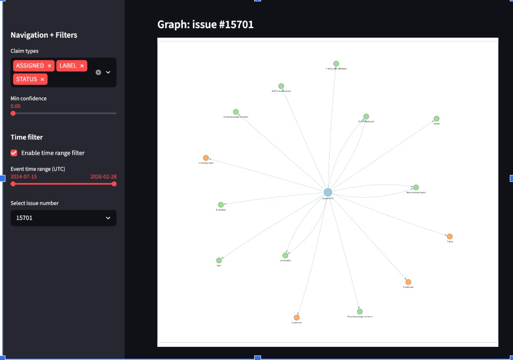
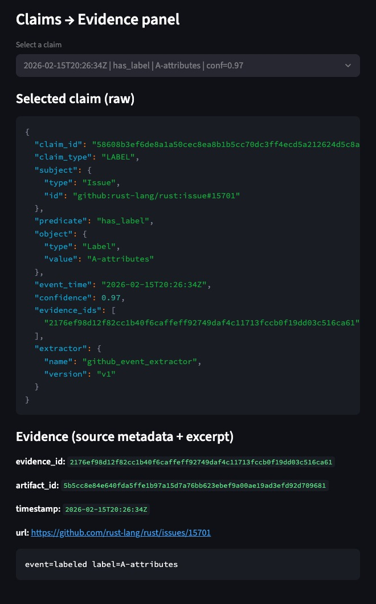

# Memory Graph from GitHub Issues

This project builds a structured memory graph from GitHub issue activity and provides an interactive interface to explore it.

The system ingests GitHub issues, extracts structured claims about issue state and activity, stores supporting evidence, and exposes the resulting memory through an interactive graph explorer UI.

The goal is to make repository activity machine-readable, explainable, and navigable. All claims in the memory graph are grounded in evidence from the original GitHub artifacts, ensuring that every stored fact can be traced back to its source.

---

# System Overview

The system transforms GitHub issue activity into a structured memory graph through the following pipeline:

```
GitHub Issues
      ↓
Ingestion
      ↓
Normalization + Deduplication
      ↓
Claim Extraction
      ↓
Current State Builder
      ↓
Visualization (Memory Graph Explorer)
```

The final output is an interactive graph of entities and claims with traceable evidence.

---

# Corpus

This project uses GitHub Issues from the `rust-lang/rust` repository.

Data is collected using the GitHub API through the ingestion script:

```
python src/ingest/select_issues.py
```

The script downloads issue metadata, labels, assignments, and issue events and stores them in:

```
data/raw/artifacts.jsonl
```

Artifacts collected include:

- Issues  
- Issue events  
- Labels  
- Assignees  
- Status transitions  

These artifacts are converted into structured claims.

Example:

```
Issue#153101 --has_label--> E-help-wanted
Issue#153101 --assigned_to--> JayanAXHF
Issue#153101 --status--> closed
```

Each claim links to evidence pointing to the original artifact.

---

# Repository Structure

```
Layer10.AI
│
├── data
│   ├── raw
│   │   └── artifacts.jsonl
│   │
│   └── processed
│       ├── artifacts_deduped.jsonl
│       ├── claims.jsonl
│       ├── evidence.jsonl
│       ├── current_state.jsonl
│       ├── duplicate_edges.jsonl
│       └── dedup_report.json
│
├── src
│   ├── ingest
│   │   └── select_issues.py
│   │
│   ├── processing
│   │   ├── deduplicate.py
│   │   ├── extract_claims.py
│   │   └── build_current_state.py
│   │
│   └── visualisation
│       ├── graph_view.py
│       └── app.py
│
└── README.md
```

---

# Ontology

The memory graph uses an ontology designed around issue-tracking workflows.

## Entity Types

- Issue  
- Label  
- User  
- Status  

## Relationship Types

| Predicate | Meaning |
|-----------|--------|
| has_label | Issue has a label |
| removed_label | Label removed from issue |
| assigned_to | Issue assigned to a user |
| status | Issue open or closed |

Example graph fragment:

```
Issue#153101
   ├── has_label → E-help-wanted
   ├── has_label → A-AST
   ├── assigned_to → JayanAXHF
   └── status → open
```

This ontology is intentionally simple but extensible. Additional entities such as comments, pull requests, components, or teams could easily be incorporated.

---

# Core Data Structures

## Claim

A claim represents a structured fact extracted from an artifact.

```json
{
  "claim_id": "...",
  "claim_type": "LABEL",
  "subject": {"type": "Issue", "id": "github:rust-lang/rust:issue#153101"},
  "predicate": "has_label",
  "object": {"type": "Label", "value": "E-help-wanted"},
  "event_time": "...",
  "confidence": 0.97,
  "evidence_ids": [...]
}
```

Each claim contains:

- subject entity  
- predicate relationship  
- object value/entity  
- timestamp  
- extraction confidence  
- pointers to supporting evidence  

---

## Evidence

Evidence links a claim to the original artifact.

```json
{
  "evidence_id": "...",
  "artifact_id": "...",
  "timestamp": "...",
  "url": "...",
  "quote": "..."
}
```

Evidence ensures that every claim can be traced back to the original source artifact.

---

## Current State

The latest known state of an issue computed from claims.

```json
{
  "entity_id": "github:rust-lang/rust:issue#153101",
  "current_status": "open",
  "assigned_to": "JayanAXHF",
  "labels": ["A-AST", "E-help-wanted"]
}
```

The current state is reconstructed by replaying claims in chronological order.

---

# Extraction Contract

The extraction layer converts GitHub artifacts into structured claims.

Each extracted claim must include:

- subject  
- predicate  
- object  
- event_time  
- evidence_ids  
- confidence  

The extraction pipeline enforces grounding by ensuring that every claim references evidence.

Extraction outputs are validated to ensure schema correctness. Invalid outputs are either normalized or discarded. Deterministic normalization ensures that equivalent entities and values are represented consistently across artifacts.

Extraction outputs also include version identifiers so that the dataset can be reprocessed when the ontology or extraction logic evolves.

Claims are only persisted if they pass confidence thresholds and have valid evidence references.

---

# Deduplication and Canonicalization

Duplicate information frequently appears across issue trackers. The system performs deduplication at multiple levels.

## Artifact Deduplication

Artifacts are normalized and hashed:

```
sha256(normalized_artifact)
```

Identical artifacts are merged.

Outputs:

```
artifacts_deduped.jsonl
duplicate_edges.jsonl
dedup_report.json
```

## Entity Canonicalization

Entity identifiers follow canonical forms such as:

```
github:rust-lang/rust:issue#153101
```

This prevents duplication across ingestion passes.

## Claim Deduplication

Repeated claims are merged while preserving multiple supporting evidence items.

## Conflict and Revision Handling

Claims represent events in time. Later claims override earlier ones when computing the current state.

Example:

```
t1: Issue#153101 has_label needs-triage
t2: Issue#153101 removed_label needs-triage
t3: Issue#153101 has_label A-AST
```

All deduplication operations are recorded in `duplicate_edges.jsonl` so merges remain auditable.

---

# Memory Graph Design

The memory graph consists of the following core components:

- entities  
- artifacts  
- claims  
- evidence pointers  

The graph is implemented as structured JSONL datasets.

Two time concepts are used:

- event time — when the event occurred  
- derived state time — when the system computes the latest state  

The pipeline supports incremental ingestion and idempotent processing. Reprocessing artifacts regenerates claims deterministically.

In production environments, retrieval would enforce source permissions so users only access claims grounded in artifacts they are authorized to view.

---

# Visualization Layer

An interactive interface allows exploration of the memory graph.

Run:

```
streamlit run src/visualisation/app.py
```

Open in a browser:

```
http://localhost:8501
```

The interface provides:

## Graph View

Displays entities and relationships extracted from claims.

Examples:

```
Issue → Label
Issue → Assignee
Issue → Status
```

## Filtering

The sidebar allows filtering by:

- claim type  
- confidence  
- time range  

It also lists issues active within the selected filters.

## Evidence Panel

Selecting a claim displays the supporting evidence, including:

- artifact identifier  
- timestamp  
- source URL  
- supporting excerpt  

## Duplicate Inspection

Deduplication outputs can be inspected through:

```
duplicate_edges.jsonl
dedup_report.json
```

---

# Visualization Examples

## Graph View


The graph shows relationships between issues, labels, assignees, and status claims.

---

## Evidence Panel


Selecting a claim displays the artifact and excerpt supporting the claim.

---

## Filters and Issue Navigation


The sidebar allows filtering by claim type, confidence, and time range, and lists issues active within the selected filters.

---

# Reproducibility

Tested with:

```
Python 3.10+
```

The full pipeline can be run end-to-end.

## 1. Create environment

```
python -m venv .venv
source .venv/bin/activate
```

## 2. Install dependencies

```
pip install streamlit pyvis networkx requests python-dotenv
```

## 3. Ingest GitHub issues

```
python src/ingest/select_issues.py
```

Output:

```
data/raw/artifacts.jsonl
```

## 4. Deduplicate artifacts

```
python src/processing/deduplicate.py
```

Outputs:

```
data/processed/artifacts_deduped.jsonl
data/processed/duplicate_edges.jsonl
data/processed/dedup_report.json
```

## 5. Extract claims

```
python src/processing/extract_claims.py
```

Outputs:

```
data/processed/claims.jsonl
data/processed/evidence.jsonl
```

## 6. Build current state

```
python src/processing/build_current_state.py
```

Output:

```
data/processed/current_state.jsonl
```

## 7. Launch visualization

```
streamlit run src/visualisation/app.py
```

Open:

```
http://localhost:8501
```

---

# Expected Outputs

After running the pipeline, the following files should exist:

```
data/processed/

artifacts_deduped.jsonl
claims.jsonl
evidence.jsonl
current_state.jsonl
duplicate_edges.jsonl
dedup_report.json
```

These files represent the serialized memory graph used by the visualization layer.

# Visualization Examples

## Graph View



The graph visualization shows relationships between issues, labels, assignees, and status claims. The sidebar allows filtering by claim type, confidence, and time range.

## Evidence Panel



Selecting a claim displays the supporting artifact, timestamp, source URL, and excerpt used to generate the claim.
---