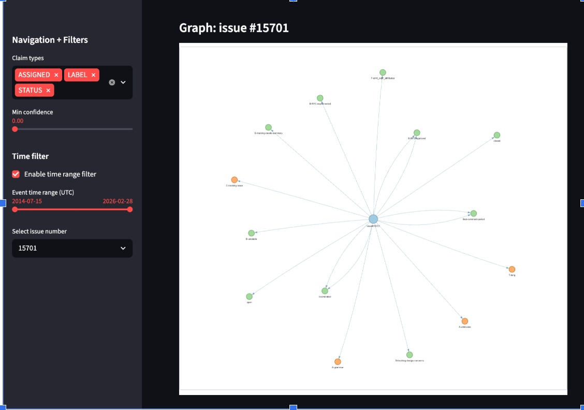
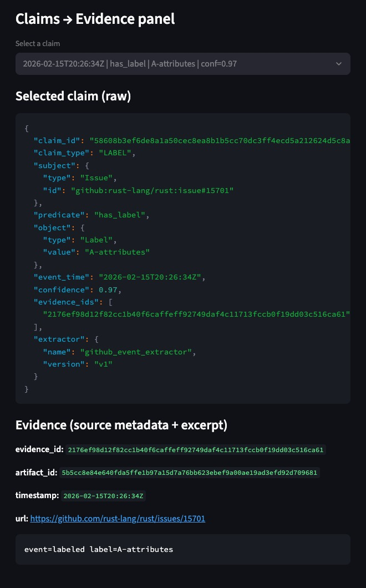

# Memory Graph from GitHub Issues

A pipeline that converts GitHub issue activity into a structured, evidence-grounded memory graph — with semantic search and LLM-based grounded Q&A on top.

<<<<<<< HEAD
Every claim in the graph is traceable back to the GitHub artifact that produced it.

## Pipeline

```
GitHub Issues → Ingest → Dedup → Extract Claims → Resolve State
              → Embed → Index → Retrieve → Generate
              → Visualize
```

## Setup

```bash
python -m venv .venv
source .venv/bin/activate
pip install -r requirements.txt
```

Create a `.env` file:
=======
The system ingests GitHub issues, extracts structured claims about issue activity, stores supporting evidence, and exposes the resulting memory through an interactive graph explorer.

Every claim in the memory graph is grounded in evidence from the original GitHub artifacts, making the system explainable and traceable.

---

# System Overview

The pipeline converts GitHub issue activity into a structured memory graph.

```
GitHub Issues
      ↓
Ingestion
      ↓
Deduplication
      ↓
Claim Extraction
      ↓
Current State Builder
      ↓
Visualization
```

The result is a graph of entities and relationships with traceable evidence.

---

# Corpus

The system uses GitHub Issues from the `rust-lang/rust` repository.

Data is collected using the GitHub API:

```
python src/ingest/select_issues.py
```

Artifacts are stored in:
>>>>>>> fdc068176de3183a5c2761a1a524974aa809e0bd

```
GITHUB_TOKEN=your_github_token
GEMINI_API_KEY=your_gemini_api_key
```

<<<<<<< HEAD
## Usage

Run each stage in order:

```bash
python src/ingest/select_issues.py        # pull issues from GitHub
python src/dedup/dedup_artifacts.py       # deduplicate artifacts
python src/extract/extract_events.py      # extract claims + evidence
python src/resolve/build_current_state.py # resolve current state

python src/retrieval/embed_claims.py      # embed claims
python src/retrieval/build_index.py       # build FAISS index
python src/retrieval/query.py             # semantic search over claims
python src/retrieval/generate.py          # grounded Q&A via Gemini

streamlit run src/visualisation/app.py    # interactive explorer
```

## How it works

- **Extraction** — GitHub issue events (labels, assignees, status changes) are turned into structured claims: `subject → predicate → object`, each linked to its source evidence (quote + URL).
- **Deduplication** — artifacts are normalized and deduplicated before extraction.
- **Retrieval** — claims are embedded (`all-MiniLM-L6-v2`) and indexed with FAISS for semantic search.
- **Generation** — Gemini answers natural-language questions using *only* retrieved claims as context, so answers stay grounded in real evidence.
- **Visualization** — a Streamlit app for exploring the graph and searching it.

## Repository Structure

```
src/
├── ingest/        # pull raw issue data from GitHub
├── dedup/         # deduplicate artifacts
├── extract/       # extract structured claims + evidence
├── resolve/       # compute current state from claims
├── retrieval/     # embed, index, retrieve, generate
└── visualisation/ # Streamlit explorer

data/
├── raw/           # ingested artifacts
└── processed/     # claims, evidence, embeddings, index
```

## Example
=======
Collected artifacts include:

- issues
- issue events
- labels
- assignees
- status changes

Example relationships extracted from artifacts:
>>>>>>> fdc068176de3183a5c2761a1a524974aa809e0bd

```
Issue#153101 --has_label--> E-help-wanted
Issue#153101 --assigned_to--> JayanAXHF
Issue#153101 --status--> closed
<<<<<<< HEAD
```
=======
```

Each claim links to the artifact that generated it.

---

# Repository Structure

```
Layer10.AI
│
├── data
│   ├── raw
│   │   └── artifacts.jsonl
│   │
│   └── processed
│       ├── artifacts_deduped.jsonl
│       ├── claims.jsonl
│       ├── evidence.jsonl
│       ├── current_state.jsonl
│       ├── duplicate_edges.jsonl
│       ├── dedup_report.json
│       └── extract_report.json
│
├── images
│   ├── graph_view.jpeg
│   └── evidence_panel.jpeg
│
├── src
│   ├── ingest
│   ├── dedup
│   ├── extract
│   ├── resolve
│   ├── retrieval
│   └── visualisation
│
├── requirements.txt
└── README.md
```

---

# Ontology

The memory graph models issue-tracking activity.

### Entity Types

- Issue
- Label
- User
- Status

### Relationship Types

| Predicate | Meaning |
|-----------|--------|
| has_label | issue has label |
| removed_label | label removed |
| assigned_to | issue assigned to user |
| status | issue open or closed |

Example:

```
Issue#153101
   ├── has_label → E-help-wanted
   ├── has_label → A-AST
   ├── assigned_to → JayanAXHF
   └── status → open
```

The ontology is intentionally simple and can be extended with entities such as comments, components, or pull requests.

---

# Core Data Structures

## Claim

A claim represents a structured fact extracted from an artifact.

```json
{
  "claim_type": "LABEL",
  "subject": {"type": "Issue", "id": "github:rust-lang/rust:issue#153101"},
  "predicate": "has_label",
  "object": {"type": "Label", "value": "E-help-wanted"},
  "event_time": "...",
  "confidence": 0.97,
  "evidence_ids": [...]
}
```

A claim contains:

- subject
- predicate
- object
- event timestamp
- extraction confidence
- evidence references

---

## Evidence

Evidence links a claim to the artifact that produced it.

```json
{
  "evidence_id": "...",
  "artifact_id": "...",
  "timestamp": "...",
  "url": "...",
  "quote": "..."
}
```

This ensures every claim is traceable to its source.

---

## Current State

The latest state of an issue derived from claims.

```json
{
  "entity_id": "github:rust-lang/rust:issue#153101",
  "current_status": "open",
  "assigned_to": "user",
  "labels": ["A-AST","E-help-wanted"]
}
```

State is computed by replaying claims chronologically.

---

# Deduplication

Duplicate artifacts are normalized and hashed:

```
sha256(normalized_artifact)
```

Outputs:

```
artifacts_deduped.jsonl
duplicate_edges.jsonl
dedup_report.json
```

Entity identifiers are canonicalized:

```
github:rust-lang/rust:issue#153101
```

Repeated claims are merged while preserving evidence references.

---

# Memory Graph Design

The memory graph contains:

- entities
- artifacts
- claims
- evidence

Two time concepts are used:

- **event time** – when the event occurred
- **derived state time** – when current state is computed

The pipeline is deterministic and can be rerun to regenerate the graph.

---

# Visualization

The memory graph can be explored through an interactive UI.

Run:

```
streamlit run src/visualisation/app.py
```

Open:

```
http://localhost:8501
```

### Graph View

Shows relationships between issues, labels, assignees, and status.

### Filters

The sidebar supports filtering by:

- claim type
- confidence
- time range

### Evidence Panel

Selecting a claim displays:

- artifact ID
- timestamp
- source URL
- supporting excerpt

### Deduplication

Duplicate merges can be inspected through:

```
duplicate_edges.jsonl
dedup_report.json
```

---

# Reproducibility

Tested with:

```
Python 3.10+
```

Run the full pipeline.

### 1. Create environment

```
python -m venv .venv
source .venv/bin/activate
```

### 2. Install dependencies

```
pip install -r requirements.txt
```

### 3. Ingest issues

```
python src/ingest/select_issues.py
```

### 4. Deduplicate artifacts

```
python src/dedup/dedup_artifacts.py
```

### 5. Extract claims

```
python src/extract/extract_events.py
```

### 6. Build current state

```
python src/resolve/build_current_state.py
```

### 7. Launch visualization

```
streamlit run src/visualisation/app.py
```

---

# Expected Outputs

After running the pipeline:

```
data/processed/

artifacts_deduped.jsonl
claims.jsonl
evidence.jsonl
current_state.jsonl
duplicate_edges.jsonl
dedup_report.json
extract_report.json
```

These files represent the serialized memory graph used by the visualization layer.

---

# Visualization Examples

## Graph View



## Evidence Panel


>>>>>>> fdc068176de3183a5c2761a1a524974aa809e0bd
